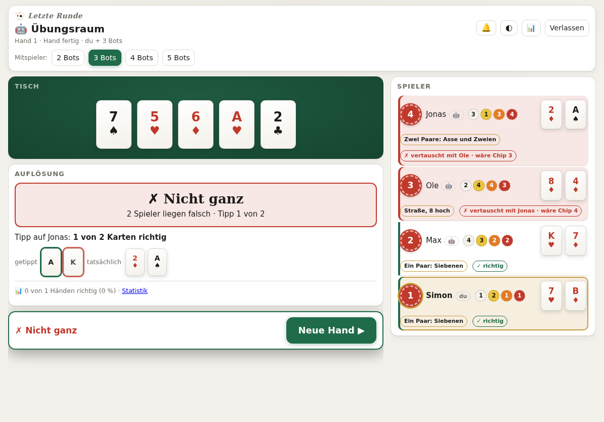
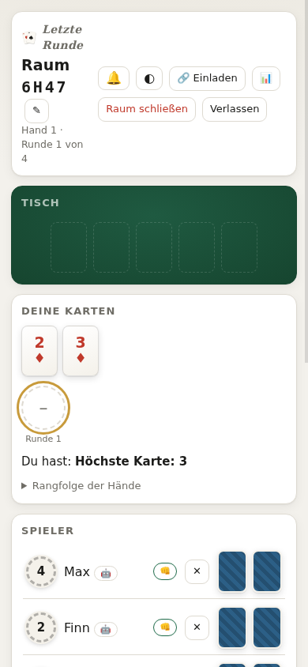

# Letzte Runde

Kooperatives Pokerkarten-Spiel für den Browser – inspiriert von „The Gang“. Alle spielen **zusammen**: Jede Runde nimmt sich jeder einen Chip von 1 (schwächste Hand) bis n (stärkste Hand). Am Ende wird aufgedeckt – stimmt die Reihenfolge, hat die Gruppe gewonnen.

Live: **[gang.aize.eu](https://gang.aize.eu)** · Spielen ohne Anmeldung, auf Handy, Tablet und PC, als App installierbar.

<p>
  
  
</p>

## Funktionen

- **Räume mit Code und Link** – Einladung per Link/QR-Code mit Vorschau in WhatsApp & Co., Raumnamen, geplante Räume mit Startzeit (Zeitzone des Planenden), Zuschauen, Einspringen für Spieler, die offline gegangen sind
- **Ablauf wie am Tisch** – 4 Runden (Hand, Flop, Turn, River), Chips aus der Mitte oder von anderen nehmen, „👊 Bereit“ und 3-2-1-Countdown, gemeinsamer Tipp auf die Karten des höchsten Chips, Aufdecken mit 10-s-Countdown
- **Hausregeln** – eine Kombination zählt nur, wenn die eigenen Karten sie verbessern (ein Paar nur auf dem Tisch zählt nicht); Flush und Straße nach der eigenen höchsten Karte benannt
- **Bots** – Übungsraum allein gegen 2–5 Bots (läuft komplett im Browser, auch **offline**) und Bots zum Auffüllen echter Räume. Bots schätzen ihre Hand per Monte-Carlo-Simulation, verhandeln um Chips und merken sich Absprachen über die Runden
- **Lernmodus** im Übungsraum – zeigt, was die eigene Hand wert ist, welcher Chip passt und nach der Hand, warum etwas anders gehört
- **Statistik** – Quote, Serien, Tipp-Treffer, Treffsicherheit je Runde
- **Extras** – Chat mit Ton, schnelle Reaktionen (👍 😂 😬 🤔 🔥), optionaler Voice-Chat (WebRTC, direkt zwischen den Geräten, mit Einwilligung), Hell/Dunkel, Querformat-Layout für Tablets

## Fair und sicher

- **Kein Server kennt die Karten.** Das Geben ist auf drei Spieler verteilt (Mischen, Verteilen A, Verteilen B; ECDH P-256 + AES-GCM im Browser). Keine Rolle allein kann eine fremde Karte lesen; aufgedeckte Karten prüft jeder Browser selbst nach. Bots übernehmen nur Rollen, wenn weniger als drei Menschen spielen.
- **Rechte serverseitig geprüft** – Geräteschlüssel je Spieler, Host-Rechte, keine fremden Plätze oder Chips.
- **Absturzsicher** – Größen- und Tiefengrenzen für Eingaben, Anfragebremse je IP, WebSocket-Grenzen, Speicherbremse, Log-Rotation.
- **Datensparsam** – keine Cookies, kein Tracking; Räume werden nach 48 Stunden ohne Aktivität gelöscht.

## Starten

Voraussetzung: **Node.js ≥ 18**. Keine Abhängigkeiten, kein Build.

```bash
cd app
node server.js            # http://localhost:3000
```

| Umgebungsvariable | Bedeutung |
|---|---|
| `PORT` | Port (Standard 3000) |
| `ADMIN_SECRET` | Passwort für `/admin.html`; ohne Angabe wird eines erzeugt und in `app/data/admin-secret.txt` abgelegt |
| `KR_MEM_MB` | Speichergrenze in MB, ab der keine neuen Räume angenommen werden (Standard 350) |

Einstellungen wie Spielerzahl, Handkarten, Tipp und Voice-Chat stehen im Admin-Bereich (`/admin.html`).

**Hosting:** Läuft z. B. unter Plesk/Phusion Passenger (Application Root `app/`, Document Root `app/public/`, Startdatei `server.js`). Für WebSockets den nginx-Proxy-Modus ausschalten; ohne WebSockets fällt das Spiel automatisch auf Abfragen im Sekundentakt zurück. `deploy.sh` ist ein Beispiel für ein Deployment per FTPS (Zugangsdaten aus einer lokalen `.env`, nicht im Repo).

## Aufbau

```
app/
  server.js        HTTP + WebSocket, Räume als JSON-Dateien, Rechteprüfung, Grenzen
  bots.js          Bots im Mehrspieler-Raum (serverseitig)
  public/
    index.html     das komplette Spiel (UI, Protokoll, Übungsraum, Lernmodus)
    hand.js        Handbewertung + Monte-Carlo – gemeinsam für Browser und Server
    sw.js          Service Worker (Übungsraum offline)
    admin.html     Admin-Bereich
tests/             End-to-End-, Angriffs-, Bot-, Voice- und Offline-Tests
design/            Logo-Quellen (SVG)
```

## Tests

```bash
tests/run.sh
```

Startet alle Testreihen parallel (je eigener Server) und gibt je Reihe eine Zeile aus; Details landen in `/tmp/kr-tests/`. Enthalten sind komplette Hände mit simulierten Browsern, Angriffe auf den Server, Bots in echten Räumen, Übungsraum und Lernmodus sowie Voice-Chat und Offline-Modus in echtem Chromium (übersprungen, wenn `chromium` fehlt). `tests/shot.js` erstellt Screenshots in mehreren Bildschirmgrößen.

## Lizenz

[MIT](LICENSE) © 2026 Simon Gutjahr. Enthält den [QR Code Generator](https://github.com/kazuhikoarase/qrcode-generator) von Kazuhiko Arase (MIT).

„The Gang“ ist ein Spiel von Kosmos; dieses Projekt ist eine unabhängige, nicht-kommerzielle Umsetzung und steht in keiner Verbindung dazu.
